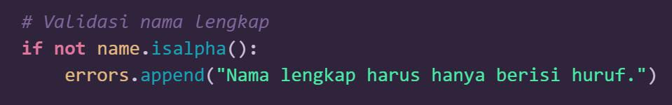
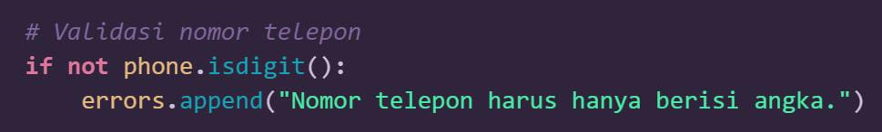
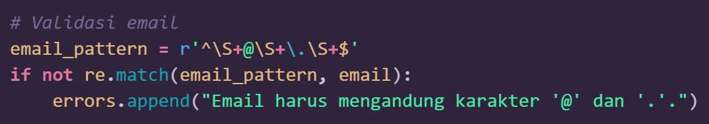
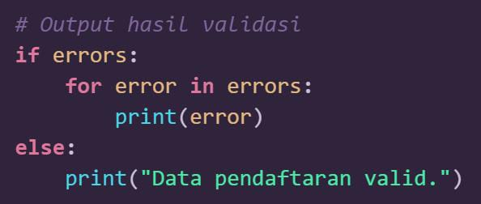
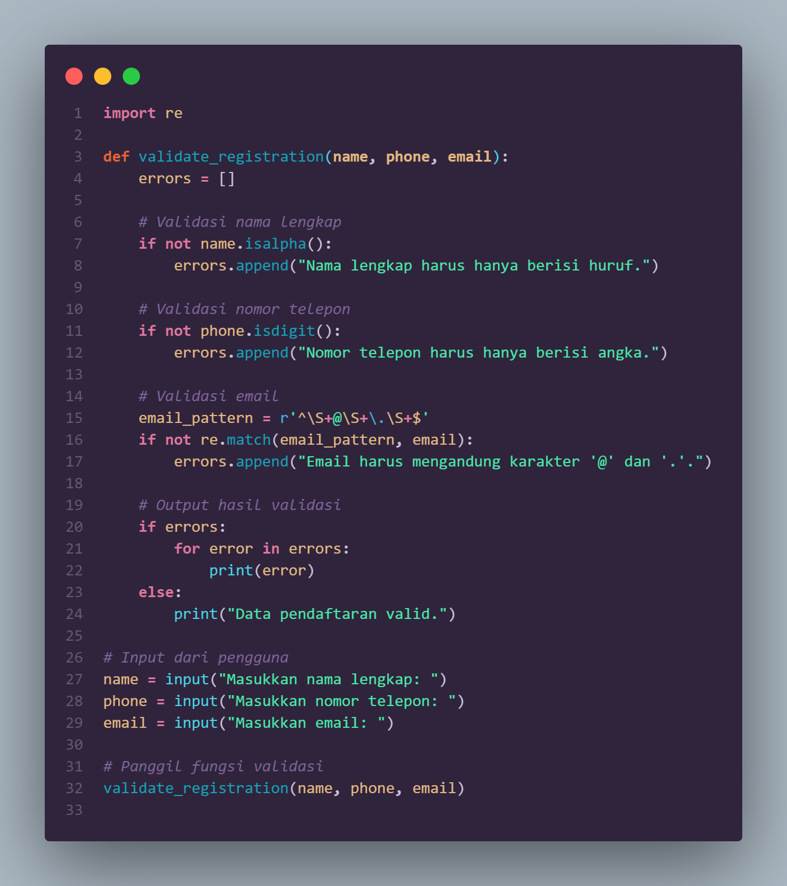
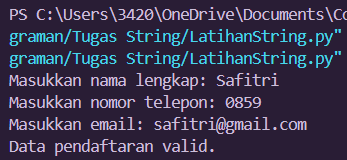
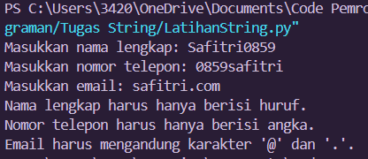

# STUDI KASUS
# Validasi Form Input

Nama: Safitri Eka Ramadhani

NIM: 312410431

Kelas: TI.24.A.3

# Validasi Input Pendaftaran Online

Program ini dibuat untuk memvalidasi data input pada proses pendaftaran online. Validasi dilakukan pada tiga jenis data: nama lengkap, nomor telepon, dan email. Program ini memberikan pesan kesalahan yang spesifik jika ada input yang tidak valid dan menyatakan bahwa data pendaftaran valid jika semua input benar.

## Cara Kerja Program

1. Validasi Nama

Penjelasan:
- Fungsi isalpha() memastikan bahwa name hanya terdiri dari huruf.
- Jika nama berisi angka, spasi, atau karakter khusus, validasi akan gagal, dan pesan error ditambahkan ke daftar errors.

2. Validasi Nomor Telepon

Penjelasan:
- Fungsi isdigit() memastikan bahwa phone hanya terdiri dari angka.
- Jika phone berisi huruf, spasi, atau karakter lain, validasi akan gagal.

3. Validasi Email

Penjelasan:
- Ekspresi reguler ^\\S+@\\S+\\.\\S+$ memastikan bahwa:
	- Ada karakter sebelum @ (\\S+ berarti non-spasi).
	- Ada karakter sebelum dan sesudah ..
	- Tidak ada spasi di seluruh string email.
- Jika format email tidak sesuai, validasi akan gagal.

4. Hasil Validasi

Penjelasan:
- Jika ada elemen dalam daftar errors, setiap pesan kesalahan akan ditampilkan.
- Jika tidak ada kesalahan, program akan menampilkan "Data pendaftaran valid."

## Persyaratan
- Python 3.x
- Library re (sudah termasuk dalam Python standar)

## Cara Menjalankan Program
1. Clone repositori ini atau salin file program ke komputer Anda.
2. Buka terminal atau command prompt.
3. Jalankan program menggunakan perintah:
   bash
   python nama_file.py
   
4. Masukkan data sesuai dengan permintaan program:
   - Nama lengkap
   - Nomor telepon
   - Email
5. Program akan menampilkan hasil validasi:
   - Pesan "Data pendaftaran valid" jika semua input benar.
   - Pesan kesalahan untuk setiap data yang tidak valid.

## Input & Output

## Input 

### Output Valid

Masukkan nama lengkap: Safitri
Masukkan nomor telepon: 0859
Masukkan email: safitri@gmail.com
Data pendaftaran valid.

### Input Tidak Valid

Masukkan nama lengkap: Safitri
Masukkan nomor telepon: 0859
Masukkan email: safitri.com
Nama lengkap harus hanya berisi huruf.
Nomor telepon harus hanya berisi angka.
Email harus mengandung karakter @ dan . serta sesuai format yang benar.

## Fitur dan Kemampuan:
- Kesesuaian dengan berbagai pengguna
- Dapat Dimodifikasi
- Keamanan dasar input
- Laporan kesalahan yang spesifik